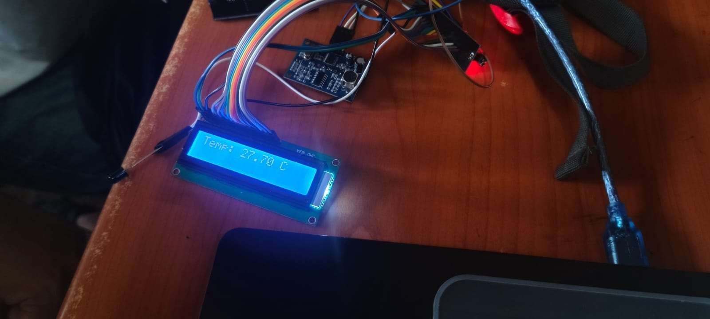
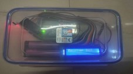

# Underwater Optical Wireless Communication (UOWC) using IR

This project demonstrates a low-cost, high-speed **Underwater Optical Wireless Communication** system using **Infrared (IR) light**.

## 📝 Abstract

This study investigates the use of IR light for underwater communication. IR LEDs act as transmitters, and photodiodes serve as receivers. The system is tested in controlled environments like water tanks and pools. Results show improved data rates compared to traditional acoustic systems.

## 🔧 Hardware Used

- Arduino Uno
- IR LED (850nm)
- TSOP37
- DHT11 (Temperature & Humidity Sensor)
- HC-SR04 (Ultrasonic Distance Sensor)
- Waterproof casing
- Supporting passive components

### Transmitter Setup
![Transmitter Setup] 

### Receiver Setup
![Receiver Setup]

### Full communication
![Final setup]

## 💡 Features

- Real-time IR-based communication up to 5 meters
- Environmental sensing (temperature, humidity)
- Data logging
- Waterproof and modular design

## 📊 Results

| Condition | Temperature (°C) |
|-----------|------------------|
| Normal    | 27               |
| Warm      | 38               |
| Cold      | 14               |

## 📁 Contents

- `/Hardware`: Circuit schematic and component list
- `/Code`: Arduino sketch
- `/Results`: Collected experimental data
- `/Images`: Photos of the setup (to be added)
- `/Paper`: Final paper (PDF)

## 📌 Applications

- Underwater exploration
- Military and scientific communication
- Environmental monitoring
